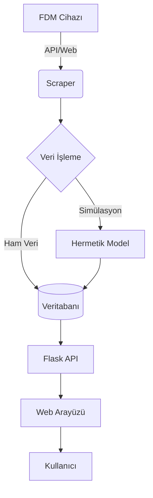

# FDMSensor Sistem Mimarisi

Bu döküman, FDMSensor projesinin teknik mimarisini, veri akışını ve ana bileşenlerini açıklar.

## 1. Genel Bakış
FDMSensor, transformatörlerden gelen sensör verilerini (FDM) toplayan, analiz eden ve bu verileri kullanarak hermetik transformatörler için termal simülasyonlar üreten bir izleme platformudur.

## 2. Bileşenler

### 2.1. Veri Toplama Katmanı (Scrapers)
Sistem iki farklı veri çekme yöntemi sunar:
- **ApiScraper (Önerilen)**: Hedef cihazın REST API'sine doğrudan erişir. RSA şifreli kimlik doğrulama kullanarak JSON verilerini çeker. Daha hızlı ve az kaynak tüketir.
- **SensorScraper (Eski/Yedek)**: Selenium tabanlıdır. Cihazın web arayüzüne (UI) girerek verileri kazır. API erişimi olmayan durumlar için tasarlanmıştır.

### 2.2. Veritabanı Katmanı (Hibrit: SQLite / PostgreSQL)
Sistem `.env` üzerinden parametrik bir veritabanı karıştırıcısıyla çalışır (`db_sqlite.py` veya `db_postgres.py`). 
Ana tablolar:
- `transformers`: İzlenen cihazların IP, kimlik bilgileri ve konum verileri.
- `sensor_data_rows`: Normalize edilmiş ham sensör verileri (Sıcaklıklar).
- `users`: Rol tabanlı erişim kontrolü için kullanıcı bilgileri.
- `weather_data`: Geçmişe dönük konum bazlı çekilen hava sıcaklığı geçmişleri.

### 2.3. Uygulama Katmanı (Flask Server)
Tüm mantığın yönetildiği merkezdir:
- **Background Scraper**: Arka planda tüm aktif trafoları periyodik olarak tarar.
- **Simulation Engine**: Gelen ham verileri (FDM Üst/Alt Yağ) hermetik transformatör modellerine (Hermetik Üst/Alt Yağ) dönüştüren termal algoritmaları çalıştırır.
- **Security Middleware**: CSRF koruması, CSP başlıkları ve oturum yönetimi.

### 2.4. Sunum Katmanı (Frontend)
- **Dashboard**: Gerçek zamanlı izleme grafiklerinin merkezi.
- **FDM Digital Twin**: Three.js tabanlı 3D modelleme ile sıcaklık dağılımının görselleştirilmesi.
- **Reports**: Tarihsel karşılaştırma ve zirve (peak) analizi.

## 3. Veri Akış Diyagramı

## 4. Güvenlik Mimarisi
- **Environment Isolation**: Hassas veriler `.env` dosyasında saklanır.
- **CSRF Protection**: Tüm Stateful (POST/PUT/DELETE) işlemler Flask-WTF ile korunur.
- **CSP Headers**: XSS saldırılarına karşı tarayıcı düzeyinde kısıtlamalar uygulanır.
- **Access Control**: `@login_required` ve `@admin_required` dekoratörleri ile yetkilendirme yapılır.
